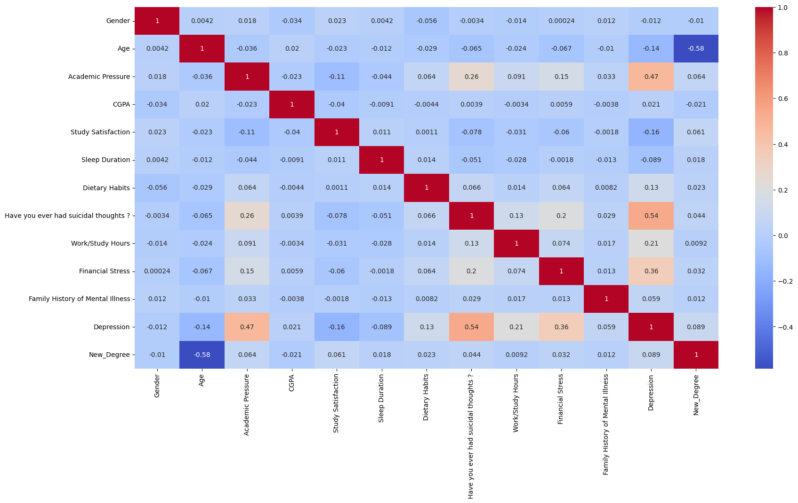
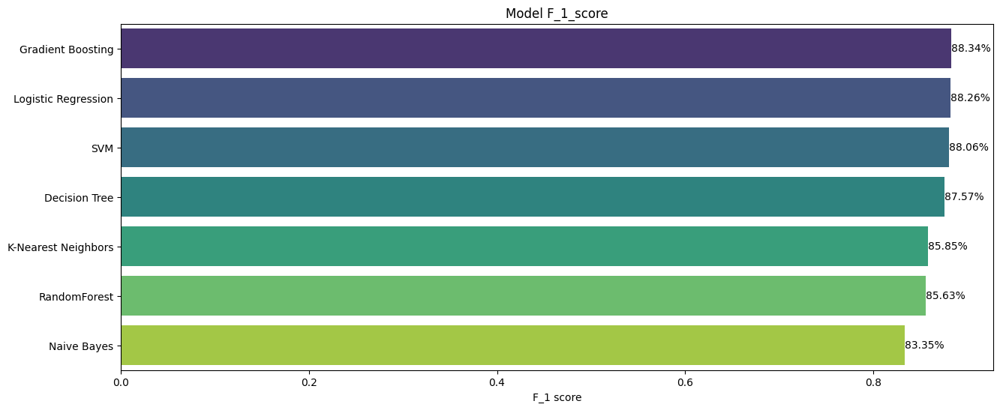

# Student-depression-research

В данном репозитории рассматривается набор данных о депрессии у студентов.

# Постановка задачи
**Задача**:  предсказть состояния депрессии у студента по его характеристикам представленным в наборе данных: 
- Age: Возраст студента
- Gender: Пол(Male, Female)
- City: Место проживания
- CGPA: Средняя академическая оценка.
- Sleep Duration: Средняя продолжительность сна в сутки
- Profession: Профессия
- Work Pressure: Рабочая нагрузка
- Academic Pressure: Учебная нагрузка
- Study Satisfaction: Удовлетворённость учебой
- Job Satisfaction: Удовлетворённость работой
- Dietary Habits: Пищевые привычки

**Цели**: 
1. Провести обработку и очистку данных
2. Обучить классификаторы
2.1 Logistic Regression
2.2 Decision Tree
2.3 Random Forest
2.4 Gradient Boosting
2.5 Naive Bayes
2.6 SVM
2.5 K-Nearest Neighbors
2.5 MLP
3. Провести анализ результатов разных моделей

# Preprocessing and data analysis
Были выполнены следующие преобразования данных:
- Удалены строки с малопредставленными в датасете городами
- Нас интересуют только студенты, поэтому данные были отфильтрованы по возрасту, профессии, работе
- Удалены не информативные колонки (Work Pressure, Profession, Job Satisfaction), так как доля работающих студентов очень мала
- Получен новый признак Education, который отражает степень образования, а не направление подготовки.
- Проведен  label-encoding для категориальных признаков (Sleep Duration, Education, Dietary Habits), one-hot encoding для признака City
- Удалены выбросы.
По этим данным была получена матрица корреляций:
 

Исходя из полученной матрицы, можно предположить, что самыми **существенными факторами** для депрессии являются:
- академическая нагрузка
- наличие негативных мыслей 
- финансовый стресс

# Обучение моделей
Для оценка качества моделей применялась F-Score метрика.
 

Все модели показали почти одинаковый результат.

Но регрессия и дерево принятий решений имеют важное преимущество - **интерпретируемость**.
В случае регрессии по весам можно понять какой признак вносит наибольший вклад в итоговое предсказание.
В нашем случае наиболее весомыми признаками являются: 
1. Financial Stress
2. Academic Pressure
3. Have you ever had suicidal thoughts ?

Данный результат подтверждает гипотезу, выдвинутую на этапе первичного анализа.

А дерево можно графически изобразить и понять по какому принципу алгоритм делит объекты по целевым классам.

Кроме того регрессия и дерево принятия решений простые алгоритмы, что также можно отнести к плюсам.

